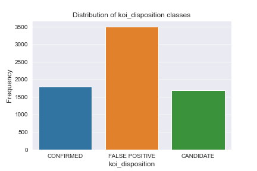
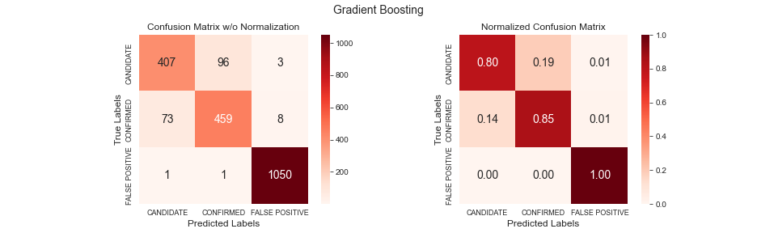
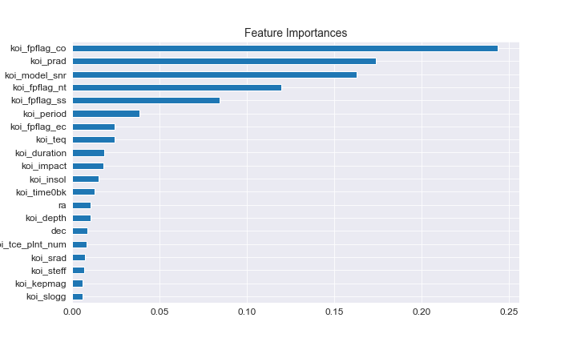

# Machine Learning Challenge - Exoplanets


Over a period of nine years in deep space, the NASA Kepler space telescope has been out on a planet-hunting mission to discover hidden planets outside of our solar system. This measurement data has been collected along with what the classification of the observation is. 

We created machine learning models capable of classifying candidate exoplanets from the raw dataset. The following macine learning supervised models were used:

- Random Forest
- Decision Tree
- Gradient Boosting
- Logistic Regression
- Deep Learning

Gradient Boosting was the best performing model with the score 91.13% before tuning and 91.33% after tuning.

## Data Source

This is [Exoplanet Data Source](https://www.kaggle.com/nasa/kepler-exoplanet-search-results). The Description of exoplanet dataset columns can be found [here](https://exoplanetarchive.ipac.caltech.edu/docs/API_kepcandidate_columns.html).

The dataset contents 41 features and we will remove all uncertainties columns that are representing errors.

We are left with twenty X features:

```
['koi_fpflag_nt', 'koi_fpflag_ss', 'koi_fpflag_co', 'koi_fpflag_ec',
       'koi_period', 'koi_time0bk', 'koi_impact', 'koi_duration', 'koi_depth',
       'koi_prad', 'koi_teq', 'koi_insol', 'koi_model_snr', 'koi_tce_plnt_num',
       'koi_steff', 'koi_slogg', 'koi_srad', 'ra', 'dec', 'koi_kepmag']
```

and one target feature (y):

```
koi_disposition
```

There are 3 classes for *koi_disposition*:  CANDIDATE, FALSE POSITIVE, CONFIRMED. 



Our data is slightly imbalanced and we tried to use SMOTE technique but there was no any impact to our results.

## Preprocessing Data

The following steps were performed:

- Check for NaN values and process them.
- Exploratory Data Analysis.
- Feature selection and removed unnecessary features.
- Separated the data into training and testing data (70:30)
- Used `MinMaxScaler` to scale the numerical data.

## Tuning Model Parameters

*  `GridSearch` was used to tune model parameters.
* Tuned and compared the following models:
  *  Random Forest
  * Decision Tree
  * Gradient Boosting
  * Logistic Regression

## Results

### Decision Tree

- **Simple Model** - The testing data score was 86%.  "False Positive" is almost 99% predicted, but part of that could be caused by imbalanced dataset. "Candidate" has a slightly worse precission but slightly better recall than "Confirmed".
- **Hyperparameters Tunin**g - The score has been improved to 89% and f1-score went up from 0.74 to 0.79/.80 for minority classes.
- **Feature Importances** - We were dropping features starting from the worst ranked feature. In each iteration we dropped one more feature. No big difference in score until we drop 10 trees. After that only slight changes until we drop 15 trees. Only a half of features have some importance.

### Random Forest

- **Simple Model** - The testing data score was 90.3%.  "False Positive" is like in all models almost 99%.  "Candidate" has a slightly worse recall than "Confirmed" but they are even at precission.
- **Hyperparameters Tuning** - The score just slightly went up to 90.8% and f1-score also went slightly up  for both minority classes.
- **Feature Importances** - The score was almost all the time around 90%. It started going down after 12 features were dropped. Before that score varied and once went above our base score. Almost all features have some importance.

### Logistic Regression

- **Simple Model** - The testing data score was 81.6%.  "False Positive" is as usually almost 100%  "Candidate" and "Confirmed" have very low f1-score, 0.60/0.67 respectively.
- **Hyperparameters Tuning** - The score went up to 83.1% and f1-score also went slightly improved  for both minority classes, 0.64 for "Candidate" and 0.69 for "Confirmed".
- **Feature Importances** - Recursive Feature Elimination (RFE) was used here. First 5 features have the highest importance. Adding each of them is changing score very much. After that the score is changing slightly. Features 19 and 20 are not changing score at all.

In general this was the worst performing model of all used in this project.

### Deep Learning

- **2-layer Model** - The last testing data accuracy was 88.85% and loss 0.2601.
- **3-layer Model** - The last testing data accuracy was 88.51% and loss  0.3463

The accuracy varied for both models between 87% and 90%. No obvious improvement could be seen by adding the 3rd layer.

### Gradient Boosting

- **Simple Model** -  The testing data score was 91.13%.  "False Positive" is like in all models almost 99%. f1-score for  "Candidate" (0.82) is slightly worse than for "Confirmed" (0.84).
- **Hyperparameters Tuning** - The testing data score went slightly up to 91.33% and this is our best model. Classification report and confusion matrix only slightly changed comparing to before tuning.

```
                precision    recall  f1-score   support

     CANDIDATE       0.85      0.80      0.82       506
     CONFIRMED       0.83      0.85      0.84       540
FALSE POSITIVE       0.99      1.00      0.99      1052

      accuracy                           0.91      2098
     macro avg       0.89      0.88      0.89      2098
  weighted avg       0.91      0.91      0.91      2098
```




- **Feature Importances** - It looks that every feature have some importance. Removing the worst ranked feature will start decreasing the score. Although, after dropping 14 features, score will go down from 91% to 88%. Still relatively high score with 6 features only.




